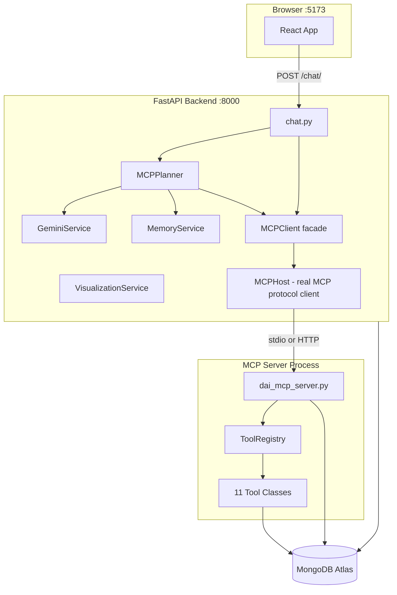
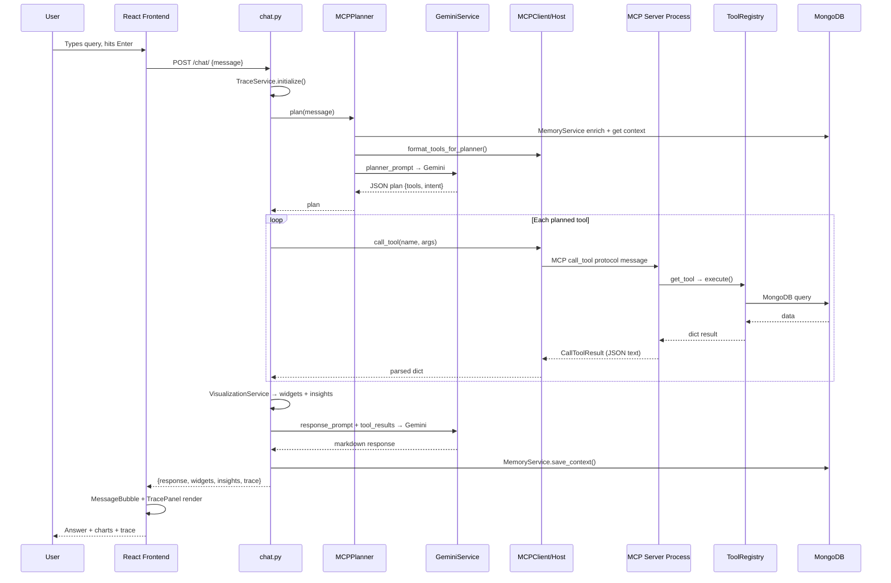

# Application flow and file responsibilities
_Exported on 6/9/2026 at 11:50:36 GMT+5:30 from Cursor (3.5.38)_

---

**User**

can you tell the flow of our total application, from top to bottom, everything inch by inch

Whatever happening internaly, like first the query comes to which, then what happens, then which file called, then tool, what happens when this happened, and how it sends to frontend, how it sends to frontend, why, then why we have thse kind of fiels, 

Each file responsible file, in what way these files are executed, why do we have mcp_host and mcp_client seperately, because host is our agent(Frontend AI UI) then client is the one who is responsible to call tool and do handshake, and do the necessary things.

Can you please explin eveyrthing in order, 

be clear, don't leave even a single file, every file and every detailing is important, I care a lot about the detailing in your explanation and the detailing, try to cover all the parts in DAI 

---

**Cursor**

I'll map the full DAI codebase first—entry points, API layer, MCP host/client, and frontend—so the end-to-end flow is accurate file by file.


Reading the core files to verify exact execution order and internal mechanics.


# DAI Application Flow — Complete Top-to-Bottom Guide

**Dai** is an internal AI assistant for **Dhaya Electric**. A React frontend sends natural-language questions to a FastAPI backend. The backend uses **Gemini** to plan and synthesize answers, and **MCP (Model Context Protocol)** to call MongoDB-backed analytics tools in a separate process.

---

## 1. Big Picture — Three Running Processes

When you develop locally, three things are usually alive:

| Process | Entry | Port | Role |
|---------|-------|------|------|
| **Frontend** | `npm run dev` | 5173 | React UI |
| **Backend API** | `python run.py` | 8000 | FastAPI orchestrator |
| **MCP Server** | spawned automatically by backend | stdio (no port) or 8001 | Tool execution over MCP protocol |



---

## 2. Startup Sequence (Before Any User Query)

### Step 1 — You start the backend

```1:9:backend/run.py
import uvicorn

if __name__ == "__main__":
    uvicorn.run(
        "app.main:app",
        host="0.0.0.0",
        port=8000,
        reload=True
    )
```

`run.py` starts Uvicorn, which loads `app.main:app`.

### Step 2 — `main.py` builds the FastAPI app

```21:64:backend/app/main.py
app = FastAPI(
    title="Dai AI Agent for Dhaya Electric :)"
)

# CORS — only allows frontend at localhost:5173
app.add_middleware(CORSMiddleware, ...)

@app.on_event("startup")
async def startup():
    MongoDB.connect()          # Backend connects to MongoDB
    await MCPClient.connect()  # Backend connects to MCP server

@app.on_event("shutdown")
async def shutdown():
    await MCPClient.disconnect()
    MongoDB.close()

app.include_router(chat_router, prefix="/chat")
```

On startup, two critical connections happen:

1. **`MongoDB.connect()`** — backend DB for memory + any direct DB use
2. **`MCPClient.connect()`** — MCP handshake (spawns tool server)

### Step 3 — Settings load from `.env`

```12:54:backend/app/config/settings.py
class Settings:
    MONGO_URI = os.getenv("MONGO_URI")
    DATABASE_NAME = os.getenv("DATABASE_NAME")
    MCP_TRANSPORT = os.getenv("MCP_TRANSPORT", "stdio")
    MCP_SERVER_COMMAND = os.getenv("MCP_SERVER_COMMAND", sys.executable)
    MCP_SERVER_ARGS = ...  # default: ["mcp_server.py", "--transport", "stdio"]
    MCP_SERVER_URL = ...   # for streamable-http mode
```

`settings.py` is the single config source for Mongo, MCP transport, and GCP env vars.

### Step 4 — MCP connection (the important part)

**`MCPClient.connect()`** is a thin wrapper:

```14:16:backend/app/mcp/client/mcp_client.py
async def connect(cls) -> None:
    await MCPHost.connect()
```

**`MCPHost.connect()`** does the real work:

1. Chooses transport from `MCP_TRANSPORT`:
   - **`stdio`** (default): spawns a child process running `python mcp_server.py --transport stdio`
   - **`streamable-http`**: connects to a remote URL like `http://127.0.0.1:8001/mcp`

2. Opens an MCP `ClientSession` over that transport

3. Runs **`initialize()`** — MCP handshake (protocol version, server info)

4. Runs **`list_tools()`** — discovers all 11 tools and caches them

```36:63:backend/app/mcp/host/mcp_host.py
async def connect(cls) -> None:
    # ... open stdio or HTTP transport ...
    cls._session = await cls._exit_stack.enter_async_context(ClientSession(read, write))
    cls._init_result = await cls._session.initialize()
    tools_response = await cls._session.list_tools()
    cls._tools = tools_response.tools
    cls._connected = True
```

### Step 5 — MCP server subprocess starts

`backend/mcp_server.py` is just a launcher:

```1:7:backend/mcp_server.py
from app.mcp.server.dai_mcp_server import main
if __name__ == "__main__":
    main()
```

That runs `dai_mcp_server.py`, which:

1. Creates a **FastMCP** server named `"Dai MCP Server"`
2. On lifespan start: **`MongoDB.connect()`** (separate connection in the MCP process)
3. Registers 11 `@mcp.tool` handlers
4. Listens on **stdio** (pipes to parent) or **HTTP :8001**

### Step 6 — Frontend starts separately

```6:9:frontend/src/main.jsx
createRoot(document.getElementById('root')).render(
  <StrictMode><App /></StrictMode>
)
```

`main.jsx` → `App.jsx` → either `LandingPage` or `ChatPage`.

---

## 3. MCP Host vs MCP Client — Your Question Answered

Your mental model was close, but the naming in this codebase is:

| Component | What it actually is | NOT |
|-----------|---------------------|-----|
| **Frontend (React)** | The AI UI the user sees | Not MCP Host |
| **`MCPHost`** | The real MCP protocol client — owns transport, session, handshake, `list_tools`, `call_tool` | Not the frontend |
| **`MCPClient`** | A facade/wrapper so `chat.py`, `planner.py`, `main.py` don't touch transport details | Not a separate network client |

**Why separate Host and Client?**

- **`MCPHost`** = low-level MCP protocol layer (stdio subprocess, HTTP, session lifecycle, parsing `CallToolResult`)
- **`MCPClient`** = stable public API for the rest of the app

In MCP terminology, the side that **connects to** the MCP server is the "MCP client." So `MCPHost` is the actual MCP client; `MCPClient` is just a clean interface on top.

**Why a separate MCP server process at all?**

- Real MCP protocol compliance (handshake, tool discovery, `call_tool`)
- Process isolation — tools run in their own process with their own Mongo connection
- Future flexibility — same server can run locally (stdio), remotely (HTTP), or in the cloud
- Mirrors how Cursor/Claude Desktop connect to MCP servers

**Legacy note:** `mcp_server.py` (in `app/mcp/server/`) is the **old in-process** executor — it bypasses MCP protocol and is **not used** in the current flow.

---

## 4. User Query Flow — Inch by Inch

Example: user types *"What is the health of vehicle TN-DS-545?"*

### Phase A — Frontend

```
LandingPage OR ChatInput
    → App.jsx handleSend(message)
    → api.js sendMessage(message)
    → POST http://localhost:8000/chat/  { "message": "..." }
```

**`App.jsx`** (`ChatPage`):

```19:42:frontend/src/App.jsx
const handleSend = async (message) => {
  setMessages(prev => [...prev, { role: "user", content: message }]);
  setLoading(true);
  const data = await sendMessage(message);
  setTrace(data.trace || []);
  setMessages(prev => [...prev, {
    role: "assistant",
    content: data.response,
    widgets: data.widgets || [],
    insights: data.insights || [],
  }]);
  setLoading(false);
};
```

**`api.js`** — single HTTP call, returns full JSON:

```11:24:frontend/src/services/api.js
export const sendMessage = async (message) => {
  const response = await API.post("/chat/", { message });
  return response.data;
};
```

While waiting: `ChatWindow` shows typing dots. `TracePanel` shows "Awaiting trace data..."

---

### Phase B — Backend receives request

**File:** `backend/app/api/chat.py`  
**Route:** `POST /chat/` (mounted at `/chat` in `main.py`)

#### B1 — Initialize trace

```25:28:backend/app/api/chat.py
trace = TraceService.initialize()  # returns []
TraceService.add_step(trace, "MCP Initialize", MCPClient.get_connection_info())
TraceService.add_step(trace, "MCP List Tools", MCPClient.get_tools_summary())
```

`TraceService` builds a list like:
```json
[
  { "step": "MCP Initialize", "details": "stdio | Dai MCP Server v..." },
  { "step": "MCP List Tools", "details": "11 tools: vehicle_health_tool, ..." }
]
```

This is **for the UI sidebar only** — it does not drive logic.

---

#### B2 — Planner decides what to do

```30:30:backend/app/api/chat.py
plan = await MCPPlanner.plan(request.message)
```

**`MCPPlanner.plan()`** (`planner.py`):

1. **`MemoryService.enrich_query()`** — expands short follow-ups like "maintenance?" → "maintenance? (for vehicle TN-DS-545)"

2. **`MemoryService.get_context()`** — reads `conversation_memory` collection from MongoDB

3. **`MCPClient.format_tools_for_planner()`** → delegates to `MCPHost` — formats all 11 tools with names, descriptions, JSON schemas

4. **`load_prompt("planner_prompt.txt", ...)`** — builds planner prompt with identity, tools, context, query

5. **`GeminiService.generate_response()`** — Gemini returns JSON like:
   ```json
   {
     "use_tool": true,
     "intent": "vehicle",
     "tools": [{
       "tool_name": "vehicle_health_tool",
       "arguments": { "vehicle_id": "TN-DS-545" }
     }]
   }
   ```

6. **`_normalize_plan()`** — fills missing `vehicle_id` from memory for follow-ups

7. If JSON parse fails → **`_fallback_plan()`** — regex/keyword fallback

```34:38:backend/app/api/chat.py
TraceService.add_step(trace, "Planner Decision", f"Intent: {intent} | Tools: {len(tools_planned)}")
await MemoryService.save_context(intent=intent, query=request.message)
```

---

#### B3 — Tool execution loop (if `use_tool: true`)

```45:77:backend/app/api/chat.py
for tool in tools_planned:
    tool_name = tool.get("tool_name")
    arguments = tool.get("arguments", {})
    TraceService.add_step(trace, "MCP Tool Selected", f"{tool_name} | {arguments}")
    
    # Save vehicle/model/plant to memory if present in args
    result = await MCPClient.call_tool(tool_name, arguments)
    validation = ToolValidationService.validate_tool_result(tool_name, result)
    
    if not validation["valid"]:
        # log warning, continue or fail
    TraceService.add_step(trace, "MCP Call Tool", f"{tool_name} → success")
    tool_outputs.append({"tool_name": tool_name, "result": result})
```

**`MCPClient.call_tool()`** → **`MCPHost.call_tool()`**:

```124:129:backend/app/mcp/host/mcp_host.py
result = await cls._session.call_tool(tool_name, arguments)
return cls._parse_tool_result(result)  # parses JSON from MCP text content
```

This sends an MCP protocol message over stdio to the child process.

---

#### B4 — Inside the MCP server process

**`dai_mcp_server.py`** receives `call_tool("vehicle_health_tool", {vehicle_id: "TN-DS-545"})`:

```38:44:backend/app/mcp/server/dai_mcp_server.py
async def _run_tool(tool_name: str, **kwargs):
    tool = ToolRegistry.get_tool(tool_name)
    filtered = {k: v for k, v in kwargs.items() if v is not None}
    return await tool.execute(**filtered)
```

**`ToolRegistry`** maps name → singleton tool instance:

```16:28:backend/app/mcp/tools/tool_registry.py
tools = {
    "vehicle_health_tool": VehicleHealthTool(),
    "maintenance_tool": MaintenanceTool(),
    # ... 9 more
}
```

**`VehicleHealthTool.execute()`**:

```
VehicleHealthTool
  → VehicleResource.get_vehicle(vehicle_id)
    → VehicleService.get_vehicle(vehicle_id)
      → MongoDB vehicles collection find_one
  → returns { vehicle_id, battery_health, temperature, status, ... }
```

Result travels back: Tool → Registry → FastMCP → stdio → MCPHost → chat.py as a Python dict.

---

#### B5 — Validation + visualization

```91:92:backend/app/api/chat.py
widgets = VisualizationService.generate_widgets(tool_outputs, plan)
insights = VisualizationService.generate_insights(tool_outputs, plan)
```

**`VisualizationService`** is rule-based (not LLM). It inspects tool outputs and plan `intent`/`visualization_hint` to build widget objects:

| Widget type | When |
|-------------|------|
| `kpi` | Single metrics (fleet summary, executive) |
| `bar_chart` | Comparisons |
| `line_chart` | Trends, telematics |
| `pie_chart` | Distributions |
| `table` | Catalog comparison, maintenance records |
| `telematics_chart` | Speed + battery over time |
| `temperature_chart` | Motor/battery temps |

---

#### B6 — Gemini synthesizes natural language answer

```94:106:backend/app/api/chat.py
final_prompt = load_prompt("response_prompt.txt",
    identity_prompt=...,
    user_query=request.message,
    intent=intent,
    tool_results=json.dumps(tool_outputs, indent=2)
)
response = await GeminiService.generate_response(final_prompt)
```

Gemini reads the raw tool JSON and writes a human-friendly markdown answer.

**If no tools were planned** (`use_tool: false`):

```119:129:backend/app/api/chat.py
general_prompt = load_prompt("fallback_prompt.txt", ...)
response = await GeminiService.generate_response(general_prompt)
# returns response with empty widgets/insights
```

---

#### B7 — Response sent to frontend

```108:117:backend/app/api/chat.py
return {
    "type": "analytics_response",
    "trace": trace,
    "tools_used": tool_outputs,
    "response": response,        # markdown text
    "widgets": widgets,          # chart/table specs
    "insights": insights,        # bullet points
    "intent": intent,
}
```

FastAPI serializes this to JSON. Axios receives it. CORS allows it because `main.py` whitelists `http://localhost:5173`.

---

### Phase C — Frontend renders response

```
App.jsx
  → setTrace(data.trace)           → TracePanel (right 25%)
  → setMessages([...botMessage])   → ChatWindow (left 75%)
       → MessageBubble
            → ReactMarkdown (response text)
            → WidgetRenderer (charts/tables/KPIs)
            → InsightsPanel (bullet insights)
```

**`TracePanel`** animates each trace step with a 400ms stagger — purely visual.

**`WidgetRenderer`** dispatches by `widget.type` to `BarChartWidget`, `LineChartWidget`, etc. (Recharts).

---

## 5. Complete File-by-File Responsibility Map

### Backend — Entry & Config

| File | Responsibility |
|------|----------------|
| `run.py` | Starts Uvicorn on port 8000 |
| `mcp_server.py` | Standalone launcher for MCP server (also spawned by host) |
| `seed.py` | Orchestrates all DB seeders |
| `requirements.txt` | Python dependencies |
| `.env` | Secrets: `MONGO_URI`, `DATABASE_NAME`, MCP settings |
| `app/config/settings.py` | Loads `.env`, exposes `settings` singleton |
| `app/main.py` | FastAPI app, CORS, startup/shutdown, mounts `/chat` router |

### Backend — API Layer

| File | Responsibility |
|------|----------------|
| `app/api/chat.py` | **Main orchestrator** — trace, plan, tool loop, viz, Gemini synthesis, JSON response |

### Backend — MCP Architecture

| File | Responsibility |
|------|----------------|
| `app/mcp/client/mcp_client.py` | **Facade** — stable API for connect/disconnect/list/call_tool |
| `app/mcp/host/mcp_host.py` | **Real MCP client** — transport, session, handshake, protocol |
| `app/mcp/host/__init__.py` | Re-exports `MCPHost` |
| `app/mcp/planner/planner.py` | LLM-based tool planning + regex fallback |
| `app/mcp/server/dai_mcp_server.py` | **Official MCP server** — FastMCP, 11 tool endpoints |
| `app/mcp/server/mcp_server.py` | **Legacy** in-process executor (unused) |

### Backend — Tools (Business Logic)

| File | Tool | Mongo Collection |
|------|------|------------------|
| `base_tool.py` | Abstract `execute()` interface | — |
| `tool_registry.py` | Name → instance map | — |
| `tool_descriptions.py` | Static docs (unused in code) | — |
| `vehicle_health_tool.py` | Battery, temp, status | `vehicles` |
| `maintenance_tool.py` | Service history | `vehicles` |
| `telematics_tool.py` | Time-series telemetry | `vehicle_telematics` |
| `vehicle_catalog_tool.py` | Model specs | `vehicle_catalog` |
| `fleet_summary_tool.py` | Fleet counts/lists | `vehicles` |
| `fleet_analytics_tool.py` | Advanced fleet health | `vehicles` |
| `sales_tool.py` | Sales with filters | `sales_data` |
| `production_tool.py` | Manufacturing stats | `manufacturing_data` |
| `plant_analytics_tool.py` | Plant facility details | `plants` |
| `executive_summary_tool.py` | Company KPIs | `vehicles`, `sales_data` |
| `analytics_tool.py` | Trends, comparisons, rankings | multiple |

### Backend — Data Access

| File | Responsibility |
|------|----------------|
| `app/database/mongodb.py` | MongoDB singleton (TLS + certifi) |
| `app/mcp/resources/vehicle_resource.py` | Vehicle data layer for tools |
| `app/services/vehicle_service.py` | `vehicles` collection queries |
| `app/models/vehicle_model.py` | Pydantic schema (currently unused) |

### Backend — Services

| File | Responsibility |
|------|----------------|
| `gemini_service.py` | Vertex AI Gemini 2.5 Flash — planner + synthesis |
| `memory_service.py` | Session context in `conversation_memory` |
| `trace_service.py` | Builds trace step arrays for UI |
| `tool_validation_service.py` | Checks empty/error tool results |
| `visualization_service.py` | Rule-based widget + insight generation |

### Backend — Utils

| File | Responsibility |
|------|----------------|
| `utils/prompt_loader.py` | Loads `.txt` prompts from `mcp/prompts/`, formats with kwargs |
| `utils/date_utils.py` | Natural language periods → date ranges for tools |
| `utils/seed_vehicles.py` | Legacy simple seeder (superseded) |

### Backend — Prompts

| File | Used by |
|------|---------|
| `identity_prompt.txt` | Planner, response, fallback — Dai's persona |
| `planner_prompt.txt` | `MCPPlanner` — tool selection instructions |
| `response_prompt.txt` | `chat.py` — synthesize tool results into answer |
| `fallback_prompt.txt` | `chat.py` — direct answer when no tools |
| `synthesis_prompt.txt` | Unused |

### Backend — Seeders

| File | Collection |
|------|------------|
| `seed_vehicle_catalog.py` | `vehicle_catalog` |
| `seed_plants.py` | `plants` |
| `seed_vehicles.py` | `vehicles` (~200 vehicles) |
| `seed_manufacturing.py` | `manufacturing_data` |
| `seed_sales.py` | `sales_data` |
| `seed_telematics.py` | `vehicle_telematics` (TN-DS-545) |

### Frontend — Entry & Config

| File | Responsibility |
|------|----------------|
| `index.html` | HTML shell, mounts `#root` |
| `src/main.jsx` | React root render |
| `package.json` | Dependencies: React 19, Vite, Tailwind, axios, recharts |
| `vite.config.js` | Vite + Tailwind plugin |
| `eslint.config.js` | Lint rules |
| `src/index.css` | Design tokens, fonts, animations |
| `src/App.css` | `.dai-app` 75/25 layout |

### Frontend — App & Pages

| File | Responsibility |
|------|----------------|
| `src/App.jsx` | Router (landing ↔ chat), `handleSend`, state for messages/trace/loading |
| `src/pages/LandingPage.jsx` | Marketing hero, query input → navigates to chat |

### Frontend — Components

| File | Responsibility |
|------|----------------|
| `services/api.js` | Axios client → `POST /chat/` |
| `ChatWindow.jsx` | Message list, typing indicator, auto-scroll |
| `ChatInput.jsx` | Textarea + send on Enter |
| `MessageBubble.jsx` | User/assistant bubbles, markdown, widgets, insights |
| `TracePanel.jsx` | Animated MCP trace sidebar |

### Frontend — Widgets

| File | Responsibility |
|------|----------------|
| `WidgetRenderer.jsx` | Dispatches widget types to components |
| `KpiWidget.jsx` | KPI card |
| `BarChartWidget.jsx` | Bar chart (Recharts) |
| `LineChartWidget.jsx` | Line chart |
| `PieChartWidget.jsx` | Pie chart |
| `TableWidget.jsx` | Data table |
| `TelematicsChartWidget.jsx` | Speed/battery dual-axis |
| `TemperatureChartWidget.jsx` | Motor/battery temps |
| `InsightsPanel.jsx` | Bullet insight list |
| `chartTheme.js` | Shared colors/tooltip styles |

---

## 6. End-to-End Sequence Diagram



---

## 7. Why This Architecture?

| Design choice | Reason |
|---------------|--------|
| **Separate MCP server process** | Real MCP protocol; isolation; can run locally or remotely |
| **MCPHost + MCPClient split** | Host = protocol/transport; Client = clean API for app code |
| **Planner uses live tool list** | Tools discovered at runtime via `list_tools()`, not hardcoded |
| **Gemini twice per query** | Once to plan (which tools), once to synthesize (human answer) |
| **VisualizationService is rule-based** | Deterministic charts; no LLM hallucination on numbers |
| **MemoryService in MongoDB** | Follow-up queries like "and maintenance?" work without re-stating vehicle ID |
| **Trace in response JSON** | Frontend gets full audit trail in one round-trip (no WebSocket needed) |
| **Widgets as data, not HTML** | Backend sends chart specs; frontend renders with Recharts |
| **CORS on :5173 only** | Dev security; frontend and backend are separate origins |
| **Two MongoDB connections** | Backend process + MCP server process each connect independently |

---

## 8. MongoDB Collections Summary

| Collection | Written by | Read by |
|------------|------------|---------|
| `vehicles` | `seed_vehicles.py` | health, maintenance, fleet tools |
| `vehicle_catalog` | `seed_vehicle_catalog.py` | catalog tool |
| `plants` | `seed_plants.py` | plant analytics |
| `manufacturing_data` | `seed_manufacturing.py` | production, analytics |
| `sales_data` | `seed_sales.py` | sales, analytics, executive |
| `vehicle_telematics` | `seed_telematics.py` | telematics tool |
| `conversation_memory` | runtime (`MemoryService`) | planner follow-ups |

---

## 9. Two Paths Through the System

**Path A — Tool path** (data questions):
```
Query → Planner (Gemini) → MCP tools → MongoDB → VisualizationService → Gemini synthesis → UI
```

**Path B — No-tool path** (general questions):
```
Query → Planner (use_tool: false) → Gemini fallback_prompt → UI (text only)
```

---

That is the full DAI application flow: every major file, every handoff, and why each layer exists. If you want to go deeper on any single piece — e.g. one specific tool's Mongo queries, or how stdio transport works at the byte level — say which part and we can zoom in there.

